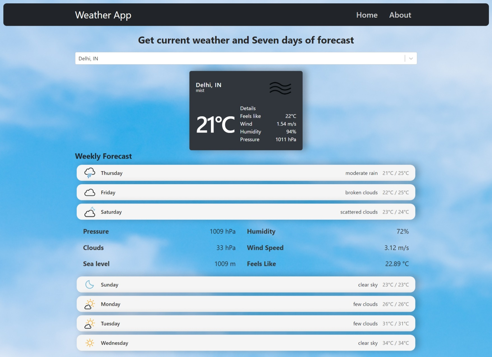

# Weather App built with React.js

Website URL: <a href="https://akodali9.github.io/weather_application/">WeatherApp.live</a>



This Weather App is a React.js-based application that utilizes the GeoDBCities API and OpenWeather Map API to provide users with current weather conditions and a seven-week forecast upon search. This readme file provides an overview of the app's features, setup instructions, usage, and dependencies.

## Features

- **Current Weather Display**: Users can search for a specific city and view the current weather conditions, including temperature, humidity, wind speed, and more.
- **Seven-Week Forecast**: The app also offers a seven-week forecast for the searched city, allowing users to plan ahead.
- **Responsive Design**: The app is designed to work seamlessly on various devices, including desktop, tablet, and mobile.

## Getting Started

Follow these steps to get the Weather App up and running on your local machine:

1. **Clone the Repository**:

   ```sh
   git clone https://github.com/akodali9/weather_application.git
   cd weather-app
   ```

2. **Install Dependencies**:

   ```sh
   npm install
   ```

3. **API Key Setup**:

   - Obtain API keys from [GeoDBCities API](https://rapidapi.com/wirefreethought/api/geodb-cities) and [OpenWeather Map API](https://openweathermap.org/api).
   - Create a `.env` file in the root directory and add your API keys like this:
     ```env
     REACT_APP_GEODB_API_KEY=your-geodb-api-key
     REACT_APP_OPENWEATHER_API_KEY=your-openweather-api-key
     ```

4. **Run the App**:

   ```sh
   npm start
   ```

5. Open your browser and navigate to `http://localhost:3000` to use the app.

## Usage

1. Enter the name of the city you want to get weather information for in the search bar.
2. Click the "Search" button.
3. The app will display the current weather conditions for the entered city, including temperature, humidity, wind speed, etc.
4. Scroll down to view the seven-week forecast for the selected city.

## Dependencies

The Weather App relies on the following dependencies:

- [React](https://reactjs.org/): A JavaScript library for building user interfaces.
- Other dependencies are listed in the `package.json` file.

## API References

- [GeoDBCities API](https://geodb-cities-api.wirefreethought.com/): Provides city-related data.
- [OpenWeather Map API](https://openweathermap.org/api): Offers weather data and forecasts.

## Contributing

Contributions are welcome! If you encounter any issues or would like to enhance the Weather App, please submit an issue or pull request on the GitHub repository.

## License

This project is licensed under the [MIT License](LICENSE).

## Contact

For any questions or inquiries, please contact [akashkodali6@gmail.com](mailto:akashkodali6@gmail.com).

---

Thank you for using the Weather App! We hope you find it helpful for quickly checking weather conditions and forecasts for various cities. Your feedback is appreciated, so feel free to share your thoughts and suggestions.
